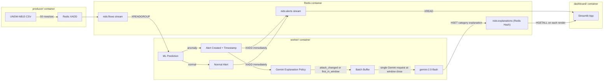

# NIDS Project: Production-Grade Streaming Architecture

This project implements a Network Intrusion Detection System (NIDS) using the UNSW-NB15 dataset. It uses two Random Forest Classifiers for binary (Normal vs. Anomaly) and multi-class (Attack Category) detection.

This version features a robust, containerized, event-driven streaming architecture using Redis Streams and Gemini AI to provide Explainable AI (XAI) for SOC analysts.

## Architecture Overview



## Prerequisites

- Docker and Docker Compose
- Gemini API Key (get one from [Google AI Studio](https://aistudio.google.com/))
- The trained models (`nids_bin_pipeline.pkl`, `nids_multi_pipeline.pkl`) and dataset (`UNSW_NB15_training-set.csv`) in the root directory.

## Setup and Running

1. Clone the repository.
2. Copy the `.env.example` file to `.env`:
   ```bash
   cp .env.example .env
   ```
3. Edit the `.env` file and insert your `GEMINI_API_KEY`.
4. Run the entire cluster with Docker Compose:
   ```bash
   docker-compose up --build
   ```
5. Open the Streamlit dashboard in your browser:
   ```
   http://localhost:8501
   ```

## Services

- **Producer**: Simulates high-speed network traffic by reading the CSV and pushing rows to Redis.
- **Worker**: Consumes flows, runs ML inference, and smartly batches anomalies to Gemini for real-time explanations, avoiding duplicate stream entries.
- **Dashboard**: A live Streamlit app joining the alert stream and AI explanation hash.

## Training (Optional)

If you need to retrain the models, you can run the local training script:
```bash
python src/train.py
```
This will regenerate the `.pkl` files required by the worker.
